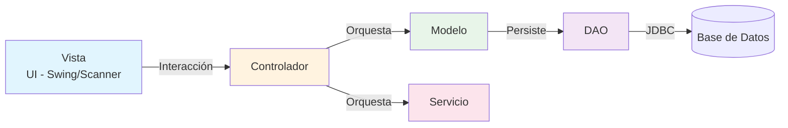
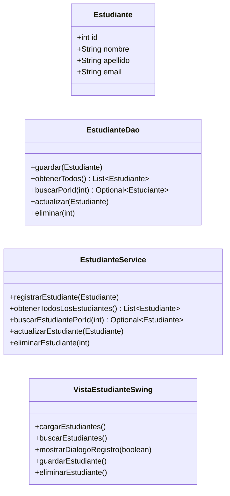
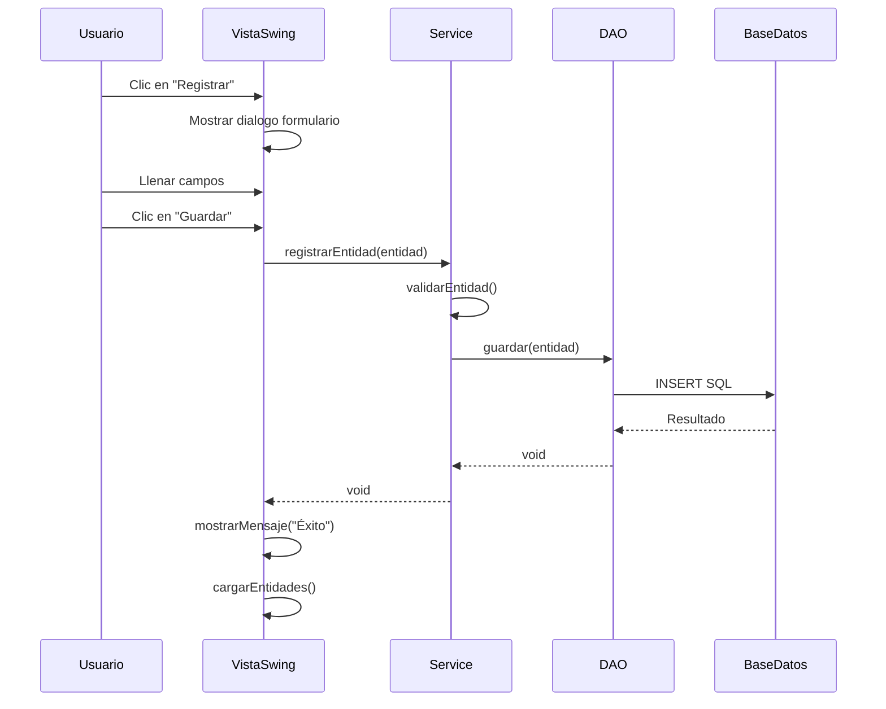

# Guía de Implementación - Sistema de Gestión Académica UNIAJC

## Tabla de Contenidos

1. [Arquitectura MVC](#arquitectura-mvc)
2. [Estructura del Proyecto](#estructura-del-proyecto)
3. [Convenciones de Código](#convenciones-de-código)
4. [Cómo Agregar una Nueva Entidad](#cómo-agregar-una-nueva-entidad)
5. [Scripts de Base de Datos](#scripts-de-base-de-datos)
6. [Checklist por Capa](#checklist-por-capa)
7. [Diagramas de Referencia](#diagramas-de-referencia)

---

## Arquitectura MVC

El patrón **MVC (Model-View-Controller)**分离la aplicación en tres componentes principales:



### Responsabilidades por Capa

| Capa | Responsabilidad | Ejemplo |
|------|---------------|---------|
| **Vista** | Interfaz con el usuario (UI) | `VistaEstudianteSwing` - muestra datos y captura input |
| **Controlador** | Orquesta flujo entre Vista y Servicio | `ControladorEstudiante` - coordina operaciones |
| **Servicio** | Lógica de negocio y validaciones | `EstudianteService` - validaciones, reglas de negocio |
| **DAO** | Persistencia en base de datos | `EstudianteDao` - operaciones CRUD |
| **Modelo** | Representación de datos | `Estudiante` - POJO con getters/setters |

---

## Estructura del Proyecto

```
src/
├── main/
│   └── java/
│       └── com/
│           └── uniajc/
│               ├── Main.java                    # Punto de entrada
│               ├── config/
│               │   └── ConexionPostgresDatabase.java
│               ├── modelo/                    # Entidades (POJOs)
│               │   └── Estudiante.java
│               ├── dao/                       # Data Access Object
│               │   └── EstudianteDao.java
│               ├── servicios/                # Lógica de negocio
│               │   └── EstudianteService.java
│               ├── controlador/               # Orquestación
│               │   └── ControladorEstudiante.java
│               └── vista/                    # Interfaz de usuario
│                   ├── VistaEstudiante.java    # Consola
│                   └── VistaEstudianteSwing.java # Swing
├── test/
│   └── java/
│       └── com/
│           └── uniajc/
│               └── servicios/
│                   └── EstudianteServiceTest.java
└── resources/
```

---

## Convenciones de Código

### Nombres de Clases

| Elemento | Convención | Ejemplo |
|----------|-----------|---------|
| Entidad | `NombreEntidad` | `Estudiante`, `Materia` |
| DAO | `NombreEntidadDao` | `EstudianteDao`, `MateriaDao` |
| Servicio | `NombreEntidadService` | `EstudianteService`, `MateriaService` |
| Controlador | `ControladorNombreEntidad` | `ControladorEstudiante`, `ControladorMateria` |
| Vista | `VistaNombreEntidad` | `VistaEstudiante`, `VistaEstudianteSwing` |

### Paquetes

- **Modelo**: `com.uniajc.modelo`
- **DAO**: `com.uniajc.dao`
- **Servicio**: `com.uniajc.servicios`
- **Controlador**: `com.uniajc.controlador`
- **Vista**: `com.uniajc.vista`

### Métodos DAO

```java
// CREATE
public void guardar(Entidad entidad)

// READ - All
public List<Entidad> obtenerTodos()

// READ - By ID
public Optional<Entidad> buscarPorId(int id)

// READ - By Field
public Optional<Entidad> buscarPorCampo(String campo)

// UPDATE
public void actualizar(Entidad entidad)

// DELETE
public void eliminar(int id)
```

### Métodos Servicio

```java
public void registrarEntidad(Entidad entidad)
public List<Entidad> obtenerTodasLasEntidades()
public Optional<Entidad> buscarEntidadPorId(int id)
public void actualizarEntidad(Entidad entidad)
public void eliminarEntidad(int id)
```

---

## Cómo Agregar una Nueva Entidad

### Paso 1: Crear la Entidad (Modelo)

```java
package com.uniajc.modelo;

public class entidad {
    private int id;
    private String nombre;
    private String atributo1;
    private String atributo2;
    
    public entidad() {}
    
    public entidad(int id, String nombre, String atributo1, String atributo2) {
        this.id = id;
        this.nombre = nombre;
        this.atributo1 = atributo1;
        this.atributo2 = atributo2;
    }
    
    // Getters y Setters
    public int getId() { return id; }
    public void setId(int id) { this.id = id; }
    
    public String getNombre() { return nombre; }
    public void setNombre(String nombre) { this.nombre = nombre; }
    
    public String getAtributo1() { return atributo1; }
    public void setAtributo1(String atributo1) { this.atributo1 = atributo1; }
    
    public String getAtributo2() { return atributo2; }
    public void setAtributo2(String atributo2) { this.atributo2 = atributo2; }
}
```

### Paso 2: Crear el DAO

```java
package com.uniajc.dao;

import java.sql.Connection;
import java.sql.PreparedStatement;
import java.sql.ResultSet;
import java.sql.SQLException;
import java.util.ArrayList;
import java.util.List;
import java.util.Optional;
import java.util.regex.Pattern;

import com.uniajc.config.ConexionPostgresDatabase;
import com.uniajc.modelo.Entidad;

public class EntidadDao {

    public void guardar(Entidad entidad) {
        String sql = "INSERT INTO \"practica-mvc\".nombre_tabla (campo1, campo2, campo3) VALUES (?, ?, ?)";
        
        try (Connection conn = ConexionPostgresDatabase.getConnection();
             PreparedStatement pstmt = conn.prepareStatement(sql)) {
            
            pstmt.setString(1, entidad.getAtributo1());
            pstmt.setString(2, entidad.getAtributo2());
            // ... demás campos
            
            pstmt.executeUpdate();
        } catch (SQLException e) {
            throw new RuntimeException("Error en base de datos", e);
        }
    }

    public List<Entidad> obtenerTodos() {
        List<Entidad> lista = new ArrayList<>();
        String sql = "SELECT id, campo1, campo2, campo3 FROM \"practica-mvc\".nombre_tabla";
        
        try (Connection conn = ConexionPostgresDatabase.getConnection();
             PreparedStatement pstmt = conn.prepareStatement(sql);
             ResultSet rs = pstmt.executeQuery()) {
            
            while (rs.next()) {
                lista.add(mapearEntidad(rs));
            }
        } catch (SQLException e) {
            throw new RuntimeException("Error en base de datos", e);
        }
        return lista;
    }

    public Optional<Entidad> buscarPorId(int id) {
        String sql = "SELECT id, campo1, campo2, campo3 FROM \"practica-mvc\".nombre_tabla WHERE id = ?";
        
        try (Connection conn = ConexionPostgresDatabase.getConnection();
             PreparedStatement pstmt = conn.prepareStatement(sql)) {
            
            pstmt.setInt(1, id);
            
            try (ResultSet rs = pstmt.executeQuery()) {
                if (rs.next()) {
                    return Optional.of(mapearEntidad(rs));
                }
            }
        } catch (SQLException e) {
            throw new RuntimeException("Error en base de datos", e);
        }
        return Optional.empty();
    }

    public void actualizar(Entidad entidad) {
        String sql = "UPDATE \"practica-mvc\".nombre_tabla SET campo1 = ?, campo2 = ?, campo3 = ? WHERE id = ?";
        
        try (Connection conn = ConexionPostgresDatabase.getConnection();
             PreparedStatement pstmt = conn.prepareStatement(sql)) {
            
            pstmt.setString(1, entidad.getAtributo1());
            pstmt.setString(2, entidad.getAtributo2());
            pstmt.setInt(3, entidad.getId());
            
            int filas = pstmt.executeUpdate();
            if (filas == 0) {
                throw new RuntimeException("Entidad no encontrada con ID: " + entidad.getId());
            }
        } catch (SQLException e) {
            throw new RuntimeException("Error en base de datos", e);
        }
    }

    public void eliminar(int id) {
        String sql = "DELETE FROM \"practica-mvc\".nombre_tabla WHERE id = ?";
        
        try (Connection conn = ConexionPostgresDatabase.getConnection();
             PreparedStatement pstmt = conn.prepareStatement(sql)) {
            
            pstmt.setInt(1, id);
            int filas = pstmt.executeUpdate();
            if (filas == 0) {
                throw new RuntimeException("Entidad no encontrada con ID: " + id);
            }
        } catch (SQLException e) {
            throw new RuntimeException("Error en base de datos", e);
        }
    }

    private Entidad mapearEntidad(ResultSet rs) throws SQLException {
        Entidad entidad = new Entidad();
        entidad.setId(rs.getInt("id"));
        entidad.setAtributo1(rs.getString("campo1"));
        entidad.setAtributo2(rs.getString("campo2"));
        return entidad;
    }
}
```

### Paso 3: Crear el Servicio

```java
package com.uniajc.servicios;

import java.util.List;
import java.util.Optional;
import java.util.regex.Pattern;

import com.uniajc.dao.EntidadDao;
import com.uniajc.modelo.Entidad;

public class EntidadService {

    private static final Pattern CAMPO_PATTERN = Pattern.compile("^[A-Za-z0-9]{3,50}$");
    private final EntidadDao entidadDao;

    public EntidadService(EntidadDao entidadDao) {
        this.entidadDao = entidadDao;
    }

    public void registrarEntidad(Entidad entidad) {
        validarEntidad(entidad);
        entidadDao.guardar(entidad);
    }

    public List<Entidad> obtenerTodasLasEntidades() {
        return entidadDao.obtenerTodos();
    }

    public Optional<Entidad> buscarEntidadPorId(int id) {
        return entidadDao.buscarPorId(id);
    }

    public void actualizarEntidad(Entidad entidad) {
        if (entidad == null || entidad.getId() <= 0) {
            throw new IllegalArgumentException("Entidad inválida.");
        }
        
        Optional<Entidad> existente = entidadDao.buscarPorId(entidad.getId());
        if (existente.isEmpty()) {
            throw new IllegalArgumentException("Entidad no encontrada.");
        }
        
        validarEntidad(entidad);
        entidadDao.actualizar(entidad);
    }

    public void eliminarEntidad(int id) {
        if (id <= 0) {
            throw new IllegalArgumentException("ID inválido.");
        }
        
        Optional<Entidad> existente = entidadDao.buscarPorId(id);
        if (existente.isEmpty()) {
            throw new IllegalArgumentException("Entidad no encontrada.");
        }
        
        entidadDao.eliminar(id);
    }

    private void validarEntidad(Entidad entidad) {
        if (entidad.getAtributo1() == null || entidad.getAtributo1().isEmpty()) {
            throw new IllegalArgumentException("El atributo1 es obligatorio.");
        }
        
        if (!CAMPO_PATTERN.matcher(entidad.getAtributo1()).matches()) {
            throw new IllegalArgumentException("El formato del atributo1 es inválido.");
        }
    }
}
```

### Paso 4: Crear la Vista Swing

```java
package com.uniajc.vista;

import java.awt.BorderLayout;
import java.awt.Color;
import java.awt.Component;
import java.awt.Dimension;
import java.awt.FlowLayout;
import java.awt.Font;
import java.awt.GridBagConstraints;
import java.awt.GridBagLayout;
import java.awt.Insets;
import java.awt.event.ActionEvent;
import java.awt.event.ActionListener;
import java.util.List;
import javax.swing.BorderFactory;
import javax.swing.DefaultTableCellRenderer;
import javax.swing.JButton;
import javax.swing.JDialog;
import javax.swing.JLabel;
import javax.swing.JOptionPane;
import javax.swing.JPanel;
import javax.swing.JScrollPane;
import javax.swing.JTable;
import javax.swing.JTextField;
import javax.swing.ListSelectionModel;
import javax.swing.SwingConstants;
import javax.swing.SwingUtilities;
import javax.swing.table.DefaultTableModel;

import com.uniajc.dao.EntidadDao;
import com.uniajc.modelo.Entidad;
import com.uniajc.servicios.EntidadService;

public class VistaEntidadSwing extends JPanel implements ActionListener {

    private static final Color COLOR_PRIMARIO = new Color(41, 128, 185);
    private static final Color COLOR_SECUNDARIO = new Color(236, 240, 241);
    private static final Color COLOR_ACENTO = new Color(231, 76, 60);
    private static final Color COLOR_EXITO = new Color(39, 174, 96);

    private static final String[] COLUMNAS = {"ID", "Campo1", "Campo2"};

    private final EntidadService entidadService;
    private JTable tabla;
    private DefaultTableModel modeloTabla;
    private JTextField textoBusqueda;
    private JButton botonBuscar;
    private JButton botonRegistrar;
    private JButton botonEditar;
    private JButton botonEliminar;
    private JButton botonActualizar;
    
    private JDialog dialogoFormulario;
    private JTextField campoAtributo1;
    private JTextField campoAtributo2;
    private JButton botonGuardar;
    private boolean modoEdicion;
    private Entidad entidadSeleccionada;

    public VistaEntidadSwing() {
        this.entidadService = new EntidadService(new EntidadDao());
        initComponents();
        cargarEntidades();
    }

    private void initComponents() {
        setLayout(new BorderLayout(10, 10));
        setBackground(COLOR_SECUNDARIO);
        setBorder(BorderFactory.createEmptyBorder(15, 15, 15, 15));

        add(crearPanelBusqueda(), BorderLayout.NORTH);
        add(crearPanelTabla(), BorderLayout.CENTER);
        add(crearPanelBotones(), BorderLayout.SOUTH);
    }

    private JPanel crearPanelBusqueda() {
        JPanel panel = new JPanel(new FlowLayout(FlowLayout.LEFT, 10, 10));
        panel.setBackground(COLOR_SECUNDARIO);

        JLabel labelBusqueda = new JLabel("Buscar:");
        labelBusqueda.setFont(new Font("Segoe UI", Font.BOLD, 13));
        labelBusqueda.setForeground(COLOR_PRIMARIO);

        textoBusqueda = new JTextField(25);
        textoBusqueda.setFont(new Font("Segoe UI", Font.PLAIN, 13));
        textoBusqueda.setPreferredSize(new Dimension(200, 30));

        botonBuscar = crearBoton("Buscar", COLOR_PRIMARIO);
        botonBuscar.addActionListener(e -> buscarEntidades());

        panel.add(labelBusqueda);
        panel.add(textoBusqueda);
        panel.add(botonBuscar);

        return panel;
    }

    private JPanel crearPanelTabla() {
        JPanel panel = new JPanel(new BorderLayout());
        panel.setBackground(COLOR_SECUNDARIO);

        modeloTabla = new DefaultTableModel(COLUMNAS, 0) {
            @Override
            public boolean isCellEditable(int row, int column) {
                return false;
            }
        };

        tabla = new JTable(modeloTabla);
        tabla.setFont(new Font("Segoe UI", Font.PLAIN, 12));
        tabla.setRowHeight(25);
        tabla.setSelectionMode(ListSelectionModel.SINGLE_SELECTION);
        tabla.setGridColor(new Color(189, 195, 199));
        tabla.setBackground(Color.WHITE);
        tabla.setSelectionBackground(COLOR_PRIMARIO);

        tabla.getTableHeader().setFont(new Font("Segoe UI", Font.BOLD, 13));
        tabla.getTableHeader().setBackground(COLOR_PRIMARIO);
        tabla.getTableHeader().setForeground(Color.WHITE);

        JScrollPane scrollPane = new JScrollPane(tabla);
        scrollPane.setBorder(BorderFactory.createLineBorder(COLOR_PRIMARIO, 2));
        scrollPane.setPreferredSize(new Dimension(600, 400));

        panel.add(scrollPane, BorderLayout.CENTER);
        return panel;
    }

    private JPanel crearPanelBotones() {
        JPanel panel = new JPanel(new FlowLayout(FlowLayout.CENTER, 15, 15));
        panel.setBackground(COLOR_SECUNDARIO);

        botonRegistrar = crearBoton("Registrar", COLOR_EXITO);
        botonRegistrar.addActionListener(e -> mostrarDialogoRegistro(false));

        botonEditar = crearBoton("Editar", COLOR_PRIMARIO);
        botonEditar.addActionListener(e -> {
            if (tabla.getSelectedRow() >= 0) {
                mostrarDialogoRegistro(true);
            } else {
                JOptionPane.showMessageDialog(this, "Seleccione una fila.", "Advertencia", JOptionPane.WARNING_MESSAGE);
            }
        });

        botonEliminar = crearBoton("Eliminar", COLOR_ACENTO);
        botonEliminar.addActionListener(e -> eliminarEntidad());

        botonActualizar = crearBoton("Actualizar", new Color(149, 165, 166));
        botonActualizar.addActionListener(e -> cargarEntidades());

        panel.add(botonRegistrar);
        panel.add(botonEditar);
        panel.add(botonEliminar);
        panel.add(botonActualizar);

        return panel;
    }

    private JButton crearBoton(String texto, Color color) {
        JButton boton = new JButton(texto);
        boton.setFont(new Font("Segoe UI", Font.BOLD, 13));
        boton.setBackground(color);
        boton.setForeground(Color.WHITE);
        boton.setFocusPainted(false);
        boton.setBorderPainted(false);
        boton.setOpaque(true);
        boton.setPreferredSize(new Dimension(110, 35));
        boton.addActionListener(this);
        return boton;
    }

    private void cargarEntidades() {
        modeloTabla.setRowCount(0);
        try {
            List<Entidad> entidades = entidadService.obtenerTodasLasEntidades();
            for (Entidad e : entidades) {
                modeloTabla.addRow(new Object[]{e.getId(), e.getAtributo1(), e.getAtributo2()});
            }
        } catch (Exception ex) {
            JOptionPane.showMessageDialog(this, "Error: " + ex.getMessage(), "Error", JOptionPane.ERROR_MESSAGE);
        }
    }

    private void buscarEntidades() {
        modeloTabla.setRowCount(0);
        String busqueda = textoBusqueda.getText().trim().toLowerCase();
        
        if (busqueda.isEmpty()) {
            cargarEntidades();
            return;
        }
        
        try {
            List<Entidad> entidades = entidadService.obtenerTodasLasEntidades();
            for (Entidad e : entidades) {
                boolean coincide = String.valueOf(e.getId()).contains(busqueda) ||
                                e.getAtributo1().toLowerCase().contains(busqueda);
                if (coincide) {
                    modeloTabla.addRow(new Object[]{e.getId(), e.getAtributo1(), e.getAtributo2()});
                }
            }
        } catch (Exception ex) {
            JOptionPane.showMessageDialog(this, "Error: " + ex.getMessage(), "Error", JOptionPane.ERROR_MESSAGE);
        }
    }

    private void mostrarDialogoRegistro(boolean esEdicion) {
        modoEdicion = esEdicion;
        
        if (esEdicion && tabla.getSelectedRow() >= 0) {
            int id = (int) modeloTabla.getValueAt(tabla.getSelectedRow(), 0);
            try {
                entidadSeleccionada = entidadService.buscarEntidadPorId(id).orElse(null);
            } catch (Exception ex) {
                JOptionPane.showMessageDialog(this, "Error: " + ex.getMessage(), "Error", JOptionPane.ERROR_MESSAGE);
                return;
            }
        } else {
            entidadSeleccionada = new Entidad();
        }

        dialogoFormulario = new JDialog((JFrame) SwingUtilities.getWindowAncestor(this),
            esEdicion ? "Editar Entidad" : "Registrar Entidad", true);
        dialogoFormulario.setSize(400, 250);
        dialogoFormulario.setLocationRelativeTo(this);

        JPanel panelFormulario = new JPanel(new GridBagLayout());
        panelFormulario.setBackground(Color.WHITE);
        panelFormulario.setBorder(BorderFactory.createEmptyBorder(20, 30, 20, 30));

        GridBagConstraints gbc = new GridBagConstraints();
        gbc.insets = new Insets(10, 10, 10, 10);
        gbc.fill = GridBagConstraints.HORIZONTAL;

        gbc.gridx = 0;
        gbc.gridy = 0;
        gbc.gridwidth = 2;
        JLabel labelTitulo = new JLabel(esEdicion ? "✏ Editar Entidad" : "➕ Registrar Entidad");
        labelTitulo.setFont(new Font("Segoe UI", Font.BOLD, 18));
        labelTitulo.setForeground(COLOR_PRIMARIO);
        panelFormulario.add(labelTitulo, gbc);

        gbc.gridwidth = 1;
        gbc.gridy++;

        JLabel labelAtributo1 = new JLabel("Atributo1:");
        labelAtributo1.setFont(new Font("Segoe UI", Font.BOLD, 13));
        gbc.gridx = 0;
        panelFormulario.add(labelAtributo1, gbc);

        campoAtributo1 = new JTextField(20);
        campoAtributo1.setFont(new Font("Segoe UI", Font.PLAIN, 13));
        gbc.gridx = 1;
        panelFormulario.add(campoAtributo1, gbc);

        gbc.gridy++;

        JLabel labelAtributo2 = new JLabel("Atributo2:");
        labelAtributo2.setFont(new Font("Segoe UI", Font.BOLD, 13));
        gbc.gridx = 0;
        panelFormulario.add(labelAtributo2, gbc);

        campoAtributo2 = new JTextField(20);
        campoAtributo2.setFont(new Font("Segoe UI", Font.PLAIN, 13));
        gbc.gridx = 1;
        panelFormulario.add(campoAtributo2, gbc);

        gbc.gridy++;
        gbc.gridwidth = 2;

        JPanel panelBotones = new JPanel(new FlowLayout(FlowLayout.CENTER, 15, 0));
        panelBotones.setBackground(Color.WHITE);

        botonGuardar = crearBoton("Guardar", COLOR_EXITO);
        botonGuardar.addActionListener(e -> guardarEntidad());

        JButton botonCancelar = crearBoton("Cancelar", new Color(149, 165, 166));
        botonCancelar.addActionListener(e -> dialogoFormulario.dispose());

        panelBotones.add(botonGuardar);
        panelBotones.add(botonCancelar);
        panelFormulario.add(panelBotones, gbc);

        if (esEdicion && entidadSeleccionada != null) {
            campoAtributo1.setText(entidadSeleccionada.getAtributo1());
            campoAtributo2.setText(entidadSeleccionada.getAtributo2());
        }

        dialogoFormulario.add(panelFormulario);
        dialogoFormulario.setVisible(true);
    }

    private void guardarEntidad() {
        try {
            String atributo1 = campoAtributo1.getText().trim();
            String atributo2 = campoAtributo2.getText().trim();

            if (atributo1.isEmpty() || atributo2.isEmpty()) {
                JOptionPane.showMessageDialog(dialogoFormulario, "Todos los campos son obligatorios.", "Validación", JOptionPane.WARNING_MESSAGE);
                return;
            }

            entidadSeleccionada.setAtributo1(atributo1);
            entidadSeleccionada.setAtributo2(atributo2);

            if (modoEdicion) {
                entidadService.actualizarEntidad(entidadSeleccionada);
                JOptionPane.showMessageDialog(dialogoFormulario, "Entidad actualizada.", "Éxito", JOptionPane.INFORMATION_MESSAGE);
            } else {
                entidadService.registrarEntidad(entidadSeleccionada);
                JOptionPane.showMessageDialog(dialogoFormulario, "Entidad registrada.", "Éxito", JOptionPane.INFORMATION_MESSAGE);
            }

            dialogoFormulario.dispose();
            cargarEntidades();
        } catch (IllegalArgumentException ex) {
            JOptionPane.showMessageDialog(dialogoFormulario, ex.getMessage(), "Validación", JOptionPane.WARNING_MESSAGE);
        } catch (Exception ex) {
            JOptionPane.showMessageDialog(dialogoFormulario, "Error: " + ex.getMessage(), "Error", JOptionPane.ERROR_MESSAGE);
        }
    }

    private void eliminarEntidad() {
        if (tabla.getSelectedRow() < 0) {
            JOptionPane.showMessageDialog(this, "Seleccione una fila.", "Advertencia", JOptionPane.WARNING_MESSAGE);
            return;
        }

        int confirmacion = JOptionPane.showConfirmDialog(this,
            "¿Eliminar la entidad seleccionada?", "Confirmar", JOptionPane.YES_NO_OPTION);

        if (confirmacion == JOptionPane.YES_OPTION) {
            try {
                int id = (int) modeloTabla.getValueAt(tabla.getSelectedRow(), 0);
                entidadService.eliminarEntidad(id);
                JOptionPane.showMessageDialog(this, "Entidad eliminada.", "Éxito", JOptionPane.INFORMATION_MESSAGE);
                cargarEntidades();
            } catch (Exception ex) {
                JOptionPane.showMessageDialog(this, "Error: " + ex.getMessage(), "Error", JOptionPane.ERROR_MESSAGE);
            }
        }
    }

    @Override
    public void actionPerformed(ActionEvent e) {}
}
```

---

## Scripts de Base de Datos

### Tabla de Estudiantes

```sql
CREATE TABLE "practica-mvc".estudiantes (
    id SERIAL PRIMARY KEY,
    name VARCHAR(100) NOT NULL,
    lastname VARCHAR(100) NOT NULL,
    email VARCHAR(100) UNIQUE NOT NULL,
    created_at TIMESTAMP DEFAULT CURRENT_TIMESTAMP
);
```

### Tabla de Docentes

```sql
CREATE TABLE "practica-mvc".docentes (
    id SERIAL PRIMARY KEY,
    name VARCHAR(100) NOT NULL,
    specialty VARCHAR(100) NOT NULL,
    email VARCHAR(100) UNIQUE NOT NULL,
    created_at TIMESTAMP DEFAULT CURRENT_TIMESTAMP
);
```

### Tabla de Materias

```sql
CREATE TABLE "practica-mvc".materias (
    id SERIAL PRIMARY KEY,
    name VARCHAR(100) NOT NULL,
    credits INT NOT NULL CHECK (credits >= 1 AND credits <= 10),
    created_at TIMESTAMP DEFAULT CURRENT_TIMESTAMP
);
```

### Tabla de Grupos

```sql
CREATE TABLE "practica-mvc".grupos (
    id SERIAL PRIMARY KEY,
    id_materia INT NOT NULL REFERENCES "practica-mvc".materias(id),
    id_docente INT NOT NULL REFERENCES "practica-mvc".docentes(id),
    classroom VARCHAR(50) NOT NULL,
    schedule VARCHAR(100) NOT NULL,
    created_at TIMESTAMP DEFAULT CURRENT_TIMESTAMP
);
```

### Tabla de Inscripciones

```sql
CREATE TABLE "practica-mvc".inscripciones (
    id SERIAL PRIMARY KEY,
    id_estudiante INT NOT NULL REFERENCES "practica-mvc".estudiantes(id),
    id_grupo INT NOT NULL REFERENCES "practica-mvc".grupos(id),
    final_grade DECIMAL(5,2) CHECK (final_grade >= 0 AND final_grade <= 5),
    status VARCHAR(20) DEFAULT 'ACTIVO' CHECK (status IN ('ACTIVO', 'APROBADO', 'REPROBADO', 'CANCELADO')),
    created_at TIMESTAMP DEFAULT CURRENT_TIMESTAMP,
    UNIQUE(id_estudiante, id_grupo)
);
```

---

## Checklist por Capa

### Capa Modelo

- [ ] Crear clase POJO en `com.uniajc.modelo`
- [ ] Definir atributos matching la tabla BD
- [ ] Crear constructor vacío
- [ ] Crear constructor con parámetros
- [ ] Agregar getters y setters para cada atributo

### Capa DAO

- [ ] Crear clase en `com.uniajc.dao`
- [ ] Implementar método `guardar(Entidad)`
- [ ] Implementar método `obtenerTodos()`
- [ ] Implementar método `buscarPorId(int id)`
- [ ] Implementar método `actualizar(Entidad)`
- [ ] Implementar método `eliminar(int id)`
- [ ] Crear método helper `mapearEntidad(ResultSet)`

### Capa Servicio

- [ ] Crear clase en `com.uniajc.servicios`
- [ ] Inyectar DAO por constructor
- [ ] Implementar método `registrarEntidad(Entidad)`
- [ ] Implementar método `obtenerTodasLasEntidades()`
- [ ] Implementar método `buscarEntidadPorId(int id)`
- [ ] Implementar método `actualizarEntidad(Entidad)`
- [ ] Implementar método `eliminarEntidad(int id)`
- [ ] Agregar validaciones de negocio

### Capa Vista (Swing)

- [ ] Crear clase que extienda JPanel
- [ ] Inyectar Service en constructor
- [ ] Crear panel de búsqueda
- [ ] Crear JTable con modelo
- [ ] Crear botones de CRUD
- [ ] Crear dialog para registro/edición
- [ ] Implementar listeners de acción
- [ ] Aplicar estilo visual (colores, fuentes)

### Integración

- [ ] Agregar opción en menú de `VistaPrincipalSwing`
- [ ] Crear instancia en el constructor de `VistaPrincipalSwing`
- [ ] Agregar al CardLayout del panel contenedor

---

## Diagramas de Referencia

### Diagrama de Clases (当前的Implementación)



### Flujo de Usuario (CRUD)



---

## Referencias de Estilo Visual

### Paleta de Colores UNIAJC

| Color | Hex | Uso |
|-------|-----|-----|
| Primary | `#2980B9` | Botones, headers |
| Secondary | `#ECF0F1` | Fondos, backgrounds |
| Acent | `#E74C3C` | Eliminar, errores |
| Success | `#27AE60` | Guardar, confirmar |
| Warning | `#F39C12` | Advertencias |
| Text Primary | `#2C3E50` | Texto principal |
| Text Secondary | `#7F8C8D` | Texto secundario |

### Configuración Look and Feel

```java
private void configurarLookAndFeel() {
    Color colorPrimario = new Color(41, 128, 185);
    Color colorSecundario = new Color(236, 240, 241);
    
    UIManager.put("Label.font", new FontUIResource("Segoe UI", Font.PLAIN, 12));
    UIManager.put("Button.font", new FontUIResource("Segoe UI", Font.BOLD, 12));
    UIManager.put("Table.font", new FontUIResource("Segoe UI", Font.PLAIN, 11));
    
    UIManager.put("Button.background", colorPrimario);
    UIManager.put("Button.foreground", Color.WHITE);
}
```

---

## Comandos Útiles

### Compilar el Proyecto

```bash
mvn clean compile
```

### Ejecutar Tests

```bash
mvn test
```

### Ejecutar la Aplicación

```bash
mvn exec:java -Dexec.mainClass="com.uniajc.Main"
```

### Empaquetar JAR

```bash
mvn package
```

---

*Esta guía fue creada para la práctica académica de UNIAJC - Sistema de Gestión Académica MVC*
*Versión 1.0 - 2026*