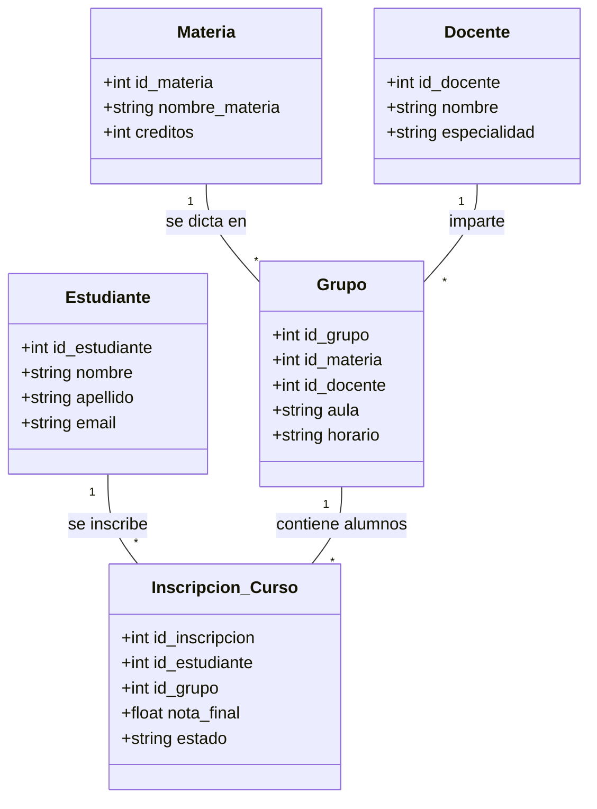

# PRÁCTICA ACADÉMICA - SISTEMA DE GESTIÓN UNIAJC (MVC + DB)

## Objetivo
Replicar el ecosistema académico propuesto en el diagrama Mermaid, siguiendo los estándares de arquitectura en capas (Entidad, DAO, Service, Controller, Vista).

## Diagrama del Ecosistema

## Instrucciones para el Estudiante:
1.  **Crea tu propia rama:** `feature/practica-[TuNombre]`.
2.  **Entidad:** Crea las clases en el paquete `com.uniajc.modelo` para las entidades restantes.
3.  **DAO:** Implementa la persistencia en `com.uniajc.modelo` usando JDBC y `ConexionDatabase`.
4.  **Servicio:** Agrega la lógica de negocio (validaciones de integridad).
5.  **Vistas:** Implementa interfaces tanto para Scanner como para Swing.
6.  **Pruebas:** Asegúrate de que tu código pase los tests de validación del docente.

## Configuración de BD:
Usa el archivo `config.properties` en la raíz para configurar tu conexión a MySQL, Postgres (Neon) o SQLite local.

---
*Recuerda: El Modelo nunca debe hablar con el usuario (sin System.out). El Controlador orquesta y la Vista interactúa.*
